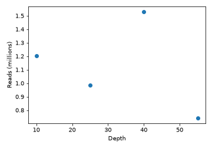

:::::::::::::::::::::::::::::::::::::: questions

- How do I run Python code in a Workbench lesson?
- How do I declare the Python packages an episode needs?
- How do I pass objects between R and Python?

::::::::::::::::::::::::::::::::::::::::::::::::

::::::::::::::::::::::::::::::::::::: objectives

- Declare an episode's Python dependencies with `py_require()`
- Write and execute `{python}` chunks alongside `{r}` chunks
- Move data across the language boundary with `py$` and `r.`

::::::::::::::::::::::::::::::::::::::::::::::::

## Declaring what the episode needs

Delete this episode if your lesson is R only. If it is not, everything you need is in the hidden
`python-setup` chunk at the top of this file, which reads:

```r
Sys.setenv(RETICULATE_PYTHON = "managed")
library(reticulate)
py_require(
  packages       = c("pandas", "matplotlib"),
  python_version = "3.12",
  exclude_newer  = "2026-08-01"
)
```

Two conventions to follow when you copy it. Give the chunk `include=FALSE` so the plumbing does
not appear in the rendered episode, and **do not label it `setup`**: sandpaper injects a chunk of
that name into every episode and knitr rejects duplicate labels.

`py_require()` does not install anything on its own. It records what the session needs, and the
first time a `{python}` chunk runs, `reticulate` uses [uv](https://docs.astral.sh/uv/) to build an
ephemeral virtual environment satisfying the whole set, downloading the interpreter as well as
the packages. Nothing lands in your system Python and nothing needs to exist beforehand.

Version constraints use pip syntax, so `"pandas>=2.2"` and `"scikit-learn==1.5.2"` both work.

::::::::::::::::::::::::::::::::::::: callout

## Why `RETICULATE_PYTHON = "managed"`

`reticulate` walks an order of discovery and only falls back to an ephemeral environment if it
finds no Python earlier in that order. On a machine with conda or miniforge on the `PATH`, conda
wins, your `py_require()` calls are silently ignored, and the episode renders against whatever
happens to be in that environment. It then fails in CI, where that environment does not exist.
Setting `"managed"` forces the reproducible path in both places.

::::::::::::::::::::::::::::::::::::::::::::::::

## Running Python

A `{python}` chunk works exactly like an `{r}` chunk:


``` python
import pandas as pd

measurements = pd.DataFrame({
    "sample":  ["A", "B", "C", "D"],
    "depth":   [10, 25, 40, 55],
    "reads":   [1_204_000, 987_000, 1_530_000, 742_000],
})

measurements
```

``` output
  sample  depth    reads
0      A     10  1204000
1      B     25   987000
2      C     40  1530000
3      D     55   742000
```

Objects persist between Python chunks in the same episode, in one shared session:


``` python
measurements["reads_per_m"] = measurements["reads"] / 1e6
measurements.describe()
```

``` output
           depth         reads  reads_per_m
count   4.000000  4.000000e+00     4.000000
mean   32.500000  1.115750e+06     1.115750
std    19.364917  3.344930e+05     0.334493
min    10.000000  7.420000e+05     0.742000
25%    21.250000  9.257500e+05     0.925750
50%    32.500000  1.095500e+06     1.095500
75%    43.750000  1.285500e+06     1.285500
max    55.000000  1.530000e+06     1.530000
```

## Crossing the language boundary

Python objects are reachable from R through `py$`, converted to their R equivalents. A pandas
`DataFrame` arrives as a `data.frame`:


``` r
str(py$measurements)
```

``` output
'data.frame':	4 obs. of  4 variables:
 $ sample     : chr  "A" "B" "C" "D"
 $ depth      : num  10 25 40 55
 $ reads      : num  1204000 987000 1530000 742000
 $ reads_per_m: num  1.204 0.987 1.53 0.742
 - attr(*, "pandas.index")=RangeIndex(start=0, stop=4, step=1)
```

``` r
summary(py$measurements$reads)
```

``` output
   Min. 1st Qu.  Median    Mean 3rd Qu.    Max. 
 742000  925750 1095500 1115750 1285500 1530000 
```

R objects go the other way through `r.`:


``` r
threshold <- 1e6
```


``` python
above = measurements[measurements["reads"] > r.threshold]
above[["sample", "reads"]]
```

``` output
  sample    reads
0      A  1204000
2      C  1530000
```

## Plots

Matplotlib figures render like any other chunk output. Set `fig.alt` for accessibility, exactly
as you would for an R plot:


``` python
import matplotlib.pyplot as plt

fig, ax = plt.subplots(figsize = (5, 3.5))
ax.scatter(measurements["depth"], measurements["reads_per_m"])
ax.set_xlabel("Depth")
ax.set_ylabel("Reads (millions)")
fig.tight_layout()
plt.show()
```



::::::::::::::::::::::::::::::::::::: challenge

## Challenge 1: add a dependency

The episode needs `numpy` as well. What do you change, and what do you commit?

:::::::::::::::::::::::: solution

Add it to the `py_require()` call in the setup chunk:

```r
py_require(c("pandas", "matplotlib", "numpy"), python_version = "3.12")
```

Nothing else. Python packages are not recorded in `renv.lock`, so the `.Rmd` file itself is the
only thing to commit. Contrast this with adding an **R** package, where you add `library(...)`,
rebuild, and then also commit the changed `renv/profiles/lesson-requirements/renv.lock`.

:::::::::::::::::::::::::::::::::

## Challenge 2: which Python is actually running?

How would you check, from inside the episode, that the managed environment is being used rather
than a conda install?

:::::::::::::::::::::::: solution

```r
reticulate::py_config()
```

The reported `python` path should sit under reticulate's own cache directory, not under
`miniforge3/` or `/usr/bin`.

:::::::::::::::::::::::::::::::::
::::::::::::::::::::::::::::::::::::::::::::::::

## When this is not enough

`py_require()` resolves from PyPI. If your lesson needs a bioconda stack, or tools that are not
packaged for PyPI, commit an `environment.yml`, point `RETICULATE_PYTHON` at that environment's
interpreter instead of `"managed"`, and add a conda setup step to
`.github/workflows/docker_build_deploy.yaml`. That is considerably more to maintain, so check
first whether the episode should be *showing* pipeline output rather than executing a pipeline at
build time.

::::::::::::::::::::::::::::::::::::: keypoints

- `Sys.setenv(RETICULATE_PYTHON = "managed")` forces the reproducible environment; without it a
  local conda install wins and the build differs from CI
- `py_require()` declares packages and the Python version; `uv` provisions them on first use
- `exclude_newer` caps resolution at a date, since `renv.lock` never records Python packages
- `py$name` reads Python objects from R, `r.name` reads R objects from Python
- No CI change is needed: `uv` fetches the interpreter inside the build container

::::::::::::::::::::::::::::::::::::::::::::::::
